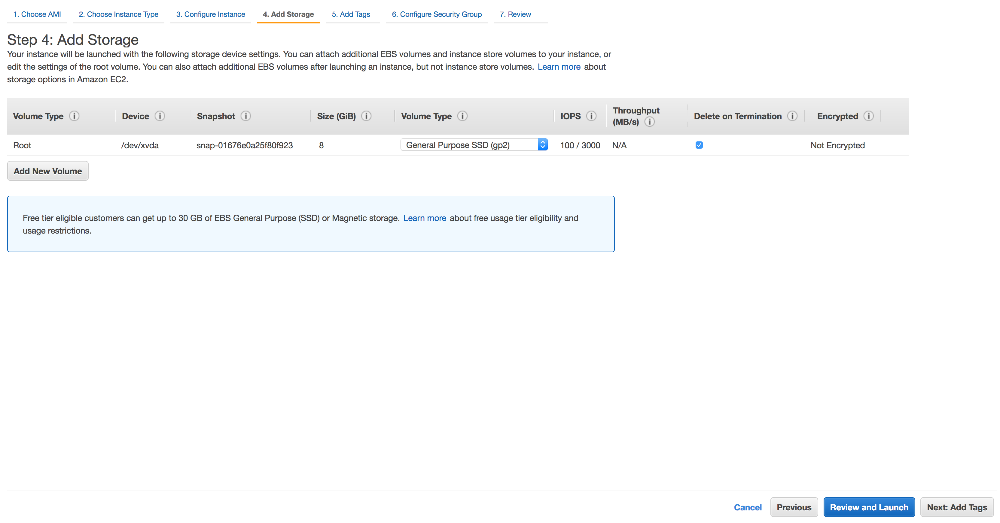
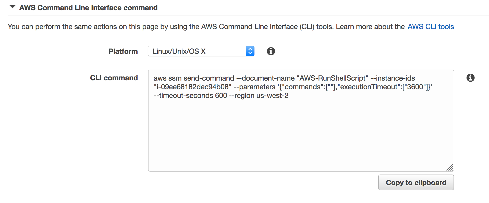

# EC2 Lost Key Recover

In this project you will be able to recover ssh access to an Amazon EC2 instance if the required private key pair has been lost.  Without a restart.

The application uses [AWS Identity and Access Management (IAM)](https://aws.amazon.com/iam/), [Amazon EC2](https://aws.amazon.com/ec2/), [AWS Systems Manager](https://aws.amazon.com/systems-manager/) and the [Amazon CLI](https://aws.amazon.com/cli/).

## Prerequisites

### AWS Account

In order to complete this project you will need an AWS Account with access to create AWS IAM, and EC2 resources. The code and instructions in this project assume that the user has Administration privileges and CLI access. 

Some of the resources you will launch as part of this workshop are eligible for the AWS free tier if your account is less than 12 months old. See the [AWS Free Tier page](https://aws.amazon.com/free/) for more details.

### Region Selection

This workshop can be deployed in any AWS region that supports the following services:

- AWS Systems Manager
- Amazon EC2

You can refer to the [region table](https://aws.amazon.com/about-aws/global-infrastructure/regional-product-services/) in the AWS documentation to see which regions have the supported services.

## Implementation Instructions

Each of the following sections provides an implementation overview and detailed, step-by-step instructions. The overview should provide enough context for you to complete the implementation if you're already familiar with the AWS Management Console or you want to explore the services yourself without following a walk-through.

### 1. Create an IAM Role.

Create an IAM Role that will be later attached to an EC2 instance.  This role will allow an EC2 instance to have access to Systems Manager.

<details>
<summary><strong>Step-by-step instructions (expand for details)</strong></summary><p>

1. From the AWS Management Console, click on **Services** and then select **IAM** in the *Security, Identity & Compliance* section.

2. Select **Roles** in the left navigation bar and then choose **Create new role**.

	><br/>

<br/>

3. Select **EC2** as service to use the role. Click **Next: Permissions**.

	><br/>

<br/>

4. Type **SSM** in the search bar and check the box left of **AmazonEC2RoleforSSM**. Click **Next: Review**.

	><br/>

<br/>

5. Give it the role name like `AmazonEC2RoleforSSMRole` and click **Create Role**.

	><br/>

</p></details>

---

### 2. Create an EC2 instance with no key-pair attached.

Start an Amazon EC2 and launch the instance without assigning a key pair.  


<details>
<summary><strong>Step-by-step instructions (expand for details)</strong></summary><p>

1. From the AWS Management Console, click on **Services** and then select **EC2** in the Compute section.

2. Click on **Launch Instance**.

	>

<br/>

3. Choose an Amazon Machine Image (AMI), for this example I choose **Amazon Linux 2 AMI (HVM), SSD Volume Type**.  Click **Select**.

	>

<br/>

4. Choose an Instance Type, for this example **t2.micro** will work.  Click **Next: Configure Instance Details**.

	>

<br/>

5. Configure Instance Details, under **IAM role** select the created role from **Step 1** which was  `AmazonEC2RoleforSSMRole`.  

	>

<br/>

6. Ensure that the EC2 is placed in a public subnet.  Click **Next: Add Storage**.

	>

<br/>

7. Add Storage, the default is fine.  Click **Next: Add Tags**.

	>

<br/>

8. Click **Add Tag** and for *Key* put `Name`.  For *Value* put `EC2noKeyPair`.  Click **Next: Configure Security Group**.

	>

<br/>

9. Configure Security Group, use an existing security group or create a new one.  Ensure that the EC2 instance has access to **Port 22** and put your EC2.  Leaving port 22 open to the world will leave the instance vulnerable.  Click **Review and Launch**.

	>

<br/>

10. Review Instance Launch, when complete.  Click **Launch**.

11. A pop up will appear to set an EC2 Key Pair.  Select **Proceed without a key pair** and **check the box** to *acknowledge that you will not be able to connect to the instance unless you know the password built into the AMI*.

	>

</p></details>

---

### 3. Install OpenSSL

OpenSSL is a robust, commercial-grade, and full-featured toolkit for the Transport Layer Security (TLS) and Secure Sockets Layer (SSL) protocols and will be used to generate a key pair.  If you have OpenSSL installed then this step can be skipped.  OpenSSL is not required to generate a key pair.  It is used in this project to show other options.

<details>
<summary><strong>Step-by-step instructions (expand for details)</strong></summary><p>

1. Download [OpenSSL](https://www.openssl.org/) onto your local computer.  For this project the instruction are written to be followed on a **mac**.

2. If **brew** is installed then enter the following command into a terminal.  If you do not have brew installed then install it from this [link](https://brew.sh/).

	``
	brew install openssl
	``

3. In the terminal enter the bellow command to verify that *OpenSSL version 1.0* or newer is installed.

	``
    openssl version
    ``

</p></details>

---

### 4. Create a key-pair using OpenSSL.

In this section you'll generate a key pair.

<details>
<summary><strong>Step-by-step instructions (expand for details)</strong></summary><p>

1. In the terminal enter the bellow command.  The name for **private_key.pem** can be changed.

	``
    openssl genpkey -algorithm RSA -pkeyopt rsa_keygen_bits:4096 -out private_key.pem
    ``

2. Verify that the private key has been generated and move to the next step.

</p></details>

---

### 5. Generate a Systems Manager Command.

The Systems Manager gives an output that can run the command via the terminal and AWS CLI.  This can be complete with only using the CLI but the **SYSTEMS MANAGER** is used to demonstrate the use via the console.

<details>
<summary><strong>Step-by-step instructions (expand for details)</strong></summary><p>

1. From the AWS Management Console, click on **Services** and then select **EC2** in the Compute section.

2. On the left hand side, expand the **SYSTEMS MANAGER SERVICES** section and click on **Run Command**.

	>

<br/>

3. Click **Run Command**.  The screen can appear different if this service has been used in the past.

	>

<br/>

4. In the **Command document** section choose **AWS-RunShellScript**.

	>

<br/>

5. In the **Select Targets by** section select the EC2 instance created from section 2.  If there are now instances then the **SSM Agent** might not be installed on the EC2 or the role from section 1 is miss-configured.

	>

<br/>

6. Go down to the bottom of the page and expand the **AWS Command Line Interface command** section.

	>

<br/>

7. **Copy** the contents in the **CLI command** text block and save to be used in the next steps.

8. Change the `"commands":[""]` section to `"commands":["echo \"\">> /home/ec2-user/.ssh/authorized_keys "]`

	>example of what the command should look like.
	```bash
	aws ssm send-command --document-name "AWS-RunShellScript" --instance-ids
	"i-09ee68182dec94b08" --parameters '{"commands":["echo \"\">>
	/home/ec2-user/.ssh/authorized_keys "],"executionTimeout":["3600"]}'
	--timeout-seconds 600 --region us-west-2
	```
 
</p></details>

---

### 6. Sending SSM command to EC2 instance.

In this module you'll send a Systems Manager command to the ec2 instance via the terminal and Amazon CLI.

<details>
<summary><strong>Step-by-step instructions (expand for details)</strong></summary><p>

1. In the terminal, go to the directory to where the private key was made and change the permissions of the key by using the below command.

	``
    chmod 400 private_key.pem
    ``

2. Once the permissions are changed then run the below command and copy the output.  ssh-keygen is used to demonstrate another tool, OpenSSL can be used as well.

	``
	ssh-keygen -y -f private_key.pem
    ``

3. From the Systems Manager command in the `echo \"\"` part.  Paste the ssh key output between the quotes.  Press **enter** to send the command.

	>example of what the command should now look like.
	```bash
	aws ssm send-command --document-name "AWS-RunShellScript" --instance-ids
	"i-09ee68182dec94b08" --parameters '{"commands":["echo \"ssh-rsa
	AAAAB3NzaC1yc2EAAAADAQABAAACAQDbfz3s8s2khw0+OyWeV6Q4CFI2yX0l
	RFXOZibuqgW/9e0koOMdjtSuoeeDqgG2y+qkVJqMDPLVb6KiWFboxONW9xPELi
	hHIh5kSAGmBJs/SIBI6Z3D8aOXHxZr0zJZ9i//+2FZcf63LDxBe7BYqpDHIHrrjISoHZ
	UJCHgfQx2w0J6pltSTHVu3AySeDe0uNgE6XqtWL9uSDzlE6ZD2wStbKZmGAieFQ
	4D3MJF1YHjTsuYns81+W+0/EjyBzbJl5oV1qsm2bRPvHs1it/V+4cyakokowdpJfH7W
	o/uvywfeTbqXaw5c8fm6H46gK3Q8xIcENoUrE+0JP1BLchVsQglatm8zblzc3nrpBFIo
	aR2cWA1EvPBsvv4zRePxguVQB3XiDbw8rfnk7MsrbYS/E6eybJYrmn31Sb+bYAFQl4
	bAAdxFe0ZzWctaf2tBs6Tm2BmU51e3M9bPcPTsSXvagmHFuKXrk7gKVPxESWT8A
	yUoS2Wp4UnHke141VGFkgRSA3K/YnEMnhBl7fjKbvLs5BJ0kxKP3xliyOFIYXWKuH
	8xPuLypV1LPZ57xDK8wWpnctr2OftgEAEjPxhycPG/HpVnN11fS5tIHQrFbmxQePKG
	gKLLZuLKHwO6vUF9eWSDciJiJ4yOtKJ6bgMtaPuqEUCfravv6xYr2dDq7EeL2yWfJw==
	SSH Key\">> /home/ec2-user/.ssh/authorized_keys "],
	"executionTimeout":["3600"]}'--timeout-seconds 600 --region us-west-2
	```

</p></details>

---

### 7. SSH onto the EC2 instance.

In this module you'll SSH into the EC2 instance.

<details>
<summary><strong>Step-by-step instructions (expand for details)</strong></summary><p>

1. From the AWS Management Console, click on **Services** and then select **EC2** in the Compute section.  On the left hand side of the console, select **Instances**.

2. Copy the **Public DNS (IPv4)** from the running EC2 instance.  Shown on the far right of the below image.

	>

<br/>

3. In the terminal enter the command `ssh -i "private_key.pem" ec2-user@` then paste the **Public DNS (IPv4)** to the end of the command. Press **enter** and below you should see...

	```
       __|  __|_  )
       _|  (     /   Amazon Linux 2 AMI
      ___|\___|___|
	```

</p></details>

---

## Finished
You now SSH'd into an instance that was created with no key pair!


